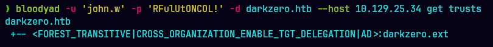
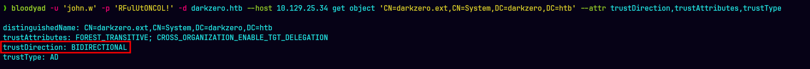
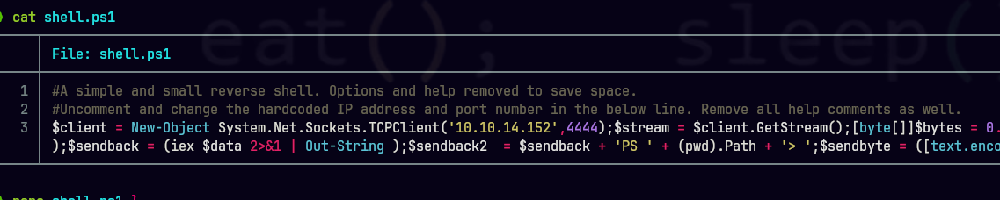
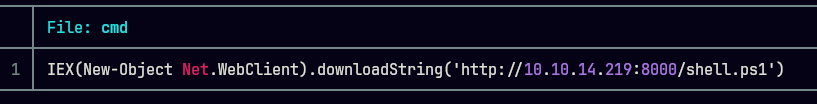
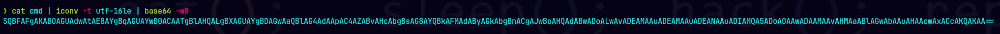
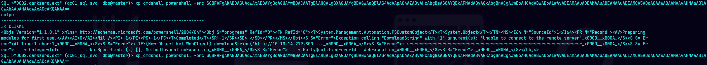
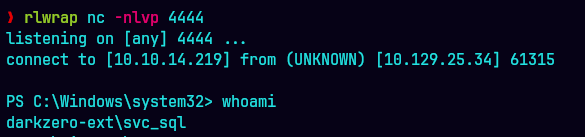

DarkZero es una máquina Windows de dificultad **Hard** basada en un escenario de *assumed breach*: nos entregan credenciales de un usuario de bajos privilegios desde el inicio. El entorno es un bosque de Active Directory con dos dominios (`darkzero.htb` y `darkzero.ext`) unidos por un **trust bidireccional**. La cadena de ataque pasa por un **MSSQL Trusted Link cross-domain**, la recuperación de privilegios de una cuenta de servicio vía **Service Logon (Logon Type 5)**, y finalmente el compromiso del dominio raíz abusando de **TGT Delegation + Unconstrained Delegation**.

Credenciales iniciales:

```
john.w / RFulUtONCOL!
```
## 1. Enumeración

### Escaneo de puertos

Empezamos con un escaneo completo de puertos y luego un escaneo de versiones/scripts sobre los que estén abiertos.


Se observa un **Microsoft SQL Server 2022** escuchando. El propio nmap nos confirma además que el servidor MSSQL tiene **autenticación NTLM habilitada**.

#### Descarga de informacion para bloodhound

```bash
bloodyad -u 'john.w' -p 'RFulUtONCOL!' -d darkzero.htb --host 10.129.24.212 get bloodhound
```
Otra forma es usar bloodhound-python

#### Enumerando con bloodyAD

Luego de enumerar muchas partes sin exito, se encontró un trust apuntando a darkzero.ext



Confirmamos si el trust es bidireccional



Tenemos la existencia de un **trust bidireccional** entre `DARKZERO.HTB` y `DARKZERO.EXT`. Es decir, no estamos ante un solo dominio sino ante un bosque con dos dominios que confían mutuamente entre sí.

#### MSSQL – (1433)

Validamos que nuestras credenciales iniciales funcionan en la autenticacion con MSSQL y se procede a enumerar


Como se sabe que ya existe un dominio de confianza (darkzero.ext) validamos un linked server. 

El linked server es una configuración legítima que permite a una instancia SQL ejecutar consultas contra otra instancia remota como si fuera local. El problema aparece cuando ese enlace guarda **credenciales de un login remoto con privilegios altos**: cualquiera que pueda usar el enlace hereda esos privilegios en el otro servidor.


Existe un enlace hacia `DC02.darkzero.ext` y el *Remote Login* configurado es `dc01_sql_svc`. Saltamos al enlace y comprobamos qué privilegios tiene ese login en el servidor remoto.

Probamos habilitar `xp_cmdshell` y ejecutar comandos del sistema operativo en DC02, atravesando la frontera entre dominios.


## 2. Foothold

Para obtener una shell interactiva, utilizaremos uno de los scripts de Nishang "Invoke-PowerShellTcpOneLine.ps1" y editamos con nuestra ip tun0 y puerto



Creamos un archivo CMD para colocar el IEX que permitira subir nuestro shell1



lo convertimos a base64



Con un servidor http con python levantado, pegamos el string en base64 en la instancia MSSQL y en otra terminal levantamos un listener con el puerto 4444





## 3. Movimiento Lateral

Enumerando la carpeta C: se encuentra un archivo sospechoso "Policy_Backup.inf", este archivo es un backup de directiva de grupo local. La sección que importa es **`Privilege Rights`**, que nos dice qué cuenta tiene asignado cada privilegio. Si se observa `SeServiceLogonRight`, vemos lo sgte:

```
SeServiceLogonRight = *S-1-5-20,svc_sql,SQLServer2005SQLBrowserUser$DC02,*S-1-5-80-0,*S-1-5-80-2652535364-2169709536-2857650723-2622804123-1107741775,*S-1-5-80-344959196-2060754871-2302487193-2804545603-1466107430,*S-1-5-80-3880718306-3832830129-1677859214-2598158968-1052248003
```
`svc_sql` tiene **derecho a iniciar sesión como servicio** y, en efecto, es la cuenta que ejecuta el `MSSQLSERVER`. La idea entonces es: si forzamos un **Service Logon (Logon Type 5)** en una sesión de alta integridad como `svc_sql`, recuperamos todos los privilegios que la cuenta debería tener por defecto, incluido `SeImpersonatePrivilege`.

El problema es que para hacer un Service Logon con las APIs `LogonUserW` / `CreateProcessWithLogonW` (que es lo que usa `RunasCs`) **necesitamos la contraseña en texto claro** de `svc_sql`, y no la tenemos. La solución: vamos a **cambiarle la contraseña a un valor que nosotros conozcamos**. Para poder hacerlo necesitamos primero recuperar su hash NT, y para eso vamos a pasar por ADCS.

### 3.1 TGT de delegación con Rubeus

Como el servicio MSSQL corre bajo `svc_sql`, podemos pedir un **fake delegation TGT** desde la sesión actual con `tgtdeleg`. Esto nos extrae un TGT del contexto de seguridad activo (es decir, de `svc_sql`) sin necesitar su contraseña.

